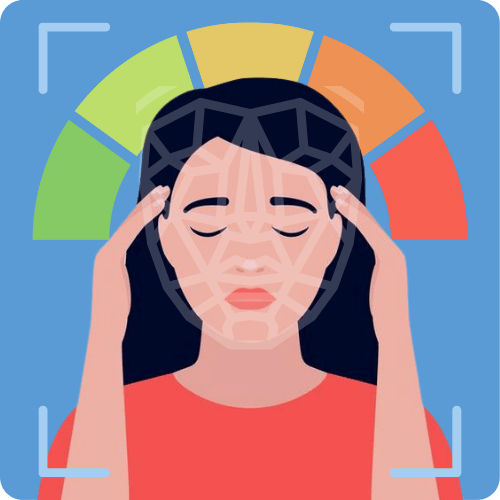

# Capstone-Bangkit-2024-Journey

<!-- PROJECT LOGO -->
 

  
  <h2 align="center">
  DekTes</h2>
  
  

  This is a project to fulfill the  <a href="https://grow.google/intl/id_id/bangkit/"><strong>Bangkit Academy led by Google, Tokopedia, Gojek, & Traveloka</strong></a>
   Program.
     
    <a href="https://github.com/jonathanlokianto/Capstone"><strong>Explore the docs »</strong></a>
     
     
    <a href="#">Project Brief</a>
    ·
    <a href="#">DekTes APK Link</a>
    ·
    <a href="#">Video Presentation</a>
    ·
    <a href="#">Presentation Slide</a>
     
    © C242-PS040 Bangkit Capstone Team
  

 

# Team Members

## Team ID : C242-PS040

 

| Name                              | Student ID    | Path                  |
| ----------------------            | ----------    | -------------------   |
| Caroline Graciela Harmanto        | M108B4KX0902  | Machine Learning      |
| Jonathan Lokianto	                | M108B4KY2091  | Machine Learning      |
| Muhammad Zidan Alif Oktavian      | M284B4KY3135  | Machine Learning      |
| Bariq Adyatma                     | C284B4KY0813  | Cloud Computing       |
| Gregorius Ivan Pratama	        | C505B4KY1646  | Cloud Computing       |
| Rahmad Firdiansyah	            | A284B4KY3623  | Mobile Development    |
| Steven Gerrard		            | A266B4KY4215  | Mobile Development    |

 

# About The Project

Stress is a recurring issue that affects people across all ages and generations. It may start as an insignificant issue, but it can prove a health hazard. Despite this, many people may not realize they are stressed until it begins to impact their daily lives. Some may also have no time to consult with psychologists about their stress. For our project, we aim to create an application that helps make self-assessment easy and available for everyone. Our application works by analyzing users’ images that were captured while they answered surveys. It then calculates and evaluates whether the user is currently experiencing high stress or low stress. Using the capability of Deep Learning on past data, our app can then make an accurate detection and give a definite answer. Through our application, we strive to provide a solution that helps people become aware of their stress conditions and gives simple guidance to relieve them. We want to contribute to increased mental health awareness among Gen Z and create an environment that supports emotional well-being in everyday life. We also aim to create a safe environment within the application where everyone can easily and accurately track their mental condition. 

 

|Learning Path->| MD | CC | ML |
| --- | --- | --- | --- |
|Programming Language|Kotlin|Node.JS , Flask|Pyhton, TF.JS|
|implementation|Design, Prototype, Aplication|API|Model|

# Documentation
You can find our relevant documentation at the following link:

## Machine Learning 
- [Machine Learning Documentation](https://github.com/jonathanlokianto/Capstone/tree/main/Machine%20Learning)

## Cloud Computing 
- [Cloud Computing Documentation](https://github.com/jonathanlokianto/Capstone/tree/main/Cloud%20Computing)

## Mobile Development 
- [Mobile Development Documentation](https://github.com/jonathanlokianto/Capstone/tree/main/Mobile%20Developer)